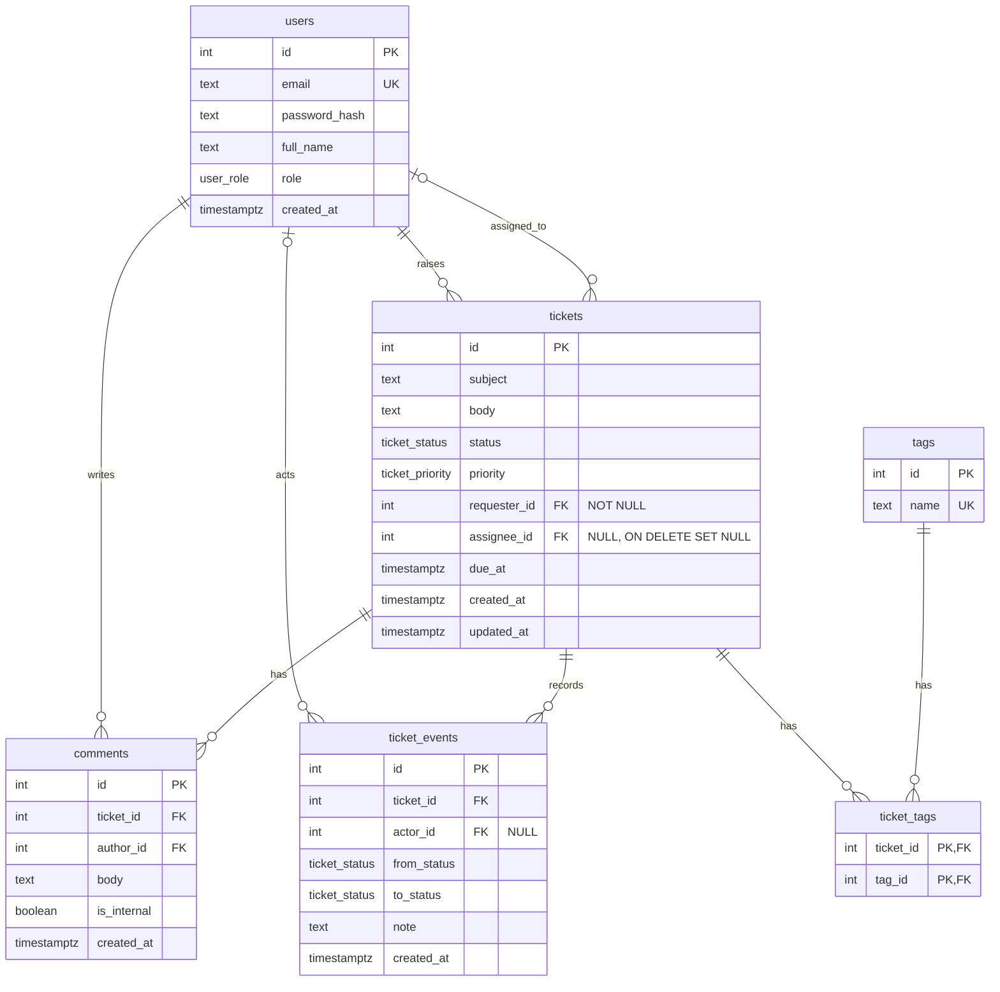

```mermaid
erDiagram

    users ||--o{ tickets : raises
    users ||--o{ comments : writes
    users o|--o{ tickets : assigned_to
    users o|--o{ ticket_events : acts

    tickets ||--o{ comments : has
    tickets ||--o{ ticket_events : records
    tickets ||--o{ ticket_tags : has
    tags ||--o{ ticket_tags : has

    users {
        int id PK
        text email UK
        text password_hash
        text full_name
        user_role role
        timestamptz created_at
    }

    tickets {
        int id PK
        text subject
        text body
        ticket_status status
        ticket_priority priority
        int requester_id FK "NOT NULL"
        int assignee_id FK "NULL, ON DELETE SET NULL"
        timestamptz due_at
        timestamptz created_at
        timestamptz updated_at
    }

    comments {
        int id PK
        int ticket_id FK
        int author_id FK
        text body
        boolean is_internal
        timestamptz created_at
    }

    tags {
        int id PK
        text name UK
    }

    ticket_tags {
        int ticket_id PK, FK
        int tag_id PK, FK
    }

    ticket_events {
        int id PK
        int ticket_id FK
        int actor_id FK "NULL"
        ticket_status from_status
        ticket_status to_status
        text note
        timestamptz created_at
    }
```